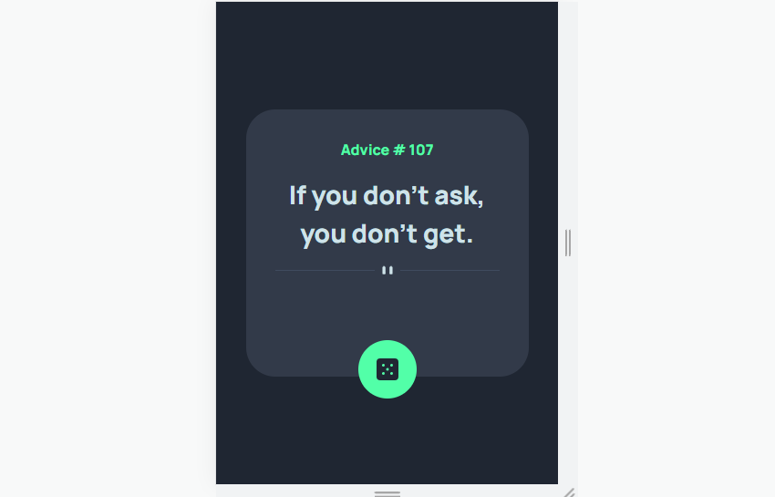
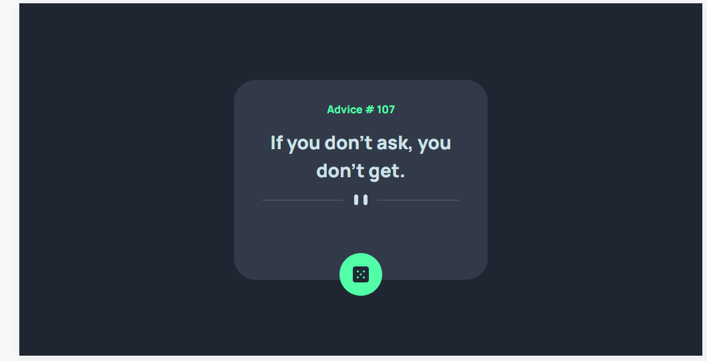

# Frontend Mentor - Product preview card component solution

This is a solution to the [Advice Generator app challenge on Frontend Mentor](https://www.frontendmentor.io/challenges/advice-generator-app-QdUG-13db/hub). Frontend Mentor challenges help you improve your coding skills by building realistic projects. 

## Table of contents

- [Overview](#overview)
  - [The challenge](#the-challenge)
  - [Screenshot](#screenshot)
  - [Links](#links)
- [My process](#my-process)
  - [Built with](#built-with)
  - [What I learned](#what-i-learned)
- [Author](#author)

## Overview

- Have replicated the frontend mentor design of advice generator app.
- Will get new advices by clicking on dice symbol every time which is being fetched from API.

### The challenge

Users should be able to:

- View the optimal layout depending on their device's screen size
- See hover and focus states for interactive elements.
- Able to fgenerate a new advice every time they click on dice symbol.

### Screenshot

### Links

- Solution URL: [Click here to view solution](https://github.com/kiran1095/advice-generator-frontendMentor)
- Live Site URL: [Click here](https://kiran1095.github.io/advice-generator-frontendMentor/)

## My process

- Fetched the API data using Jquery ajax().
- Design mark-up is completed using flex. 

### Built with

- Semantic HTML5 markup
- Flexbox.
- Jquery.

### What I learned

    - Got better understanding with usage of css Flexbox and Jquery.

### Continued development

    - Got better at using width and measurement units to support responsiveness, but still think I need more practise at using measurements like rem, vh, etc., to support better responsiveness.
    - Got better understanding of params in jqury Ajax method.

## Author

- Frontend Mentor - [@kiran1095](https://www.frontendmentor.io/profile/kiran1095)
